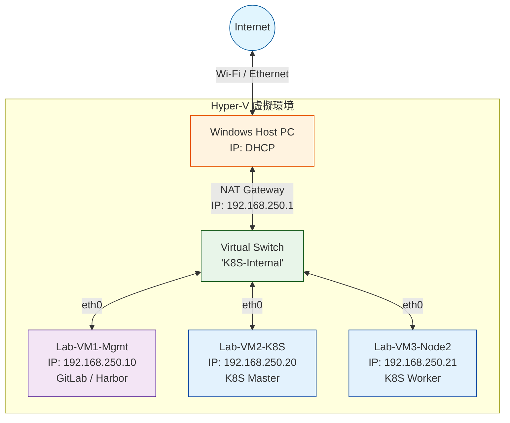

# Hyper-V 實驗室環境配置指南

本指南說明如何在 Windows 10/11 專業版或伺服器版上，利用 Hyper-V 建立適用於本專案的 Rocky Linux 10.1 虛擬機環境。

## 1. 網路拓樸與架構規劃
為了模擬企業環境並確保管理流量與測試流量分離，建議採用以下設計：



*   **Virtual Switch (內部/Internal)**: 用於所有 VM 與 Windows 主機之間的通訊。
    *   名稱建議: `K8S-Internal`
*   **靜態 IP 分配範例**:
    *   **VM1 (Management)**: `192.168.250.10` (FQDN: `gitlab.it205.ski.ad`, `harbor.it205.ski.ad`)
    *   **VM2 (K8S Node)**: `192.168.250.20`
    *   **Windows Host**: `192.168.250.1` (作為 Gateway 或 DNS 轉發)

## 2. 建立虛擬交換器
1. 以管理員權限開啟 PowerShell。
2. 執行以下命令建立內部交換器：
   ```powershell
   New-VMSwitch -Name "K8S-Internal" -SwitchType Internal
   ```
3. 為 Windows 主機上的虛擬網卡設定 IP：
   ```powershell
    Get-NetAdapter -Name "vEthernet (K8S-Internal)" | New-NetIPAddress -IPAddress 192.168.250.1 -PrefixLength 24
   ```

## 3. 虛擬機規格建議 (Rocky Linux 10.1)

### VM1: Control Plane (GitLab + Harbor)
*   **CPU**: 4 vCPUs (最低)
*   **RAM**: 8 GB (建議 12 GB 以上)
*   **Disk**: 100 GB (Thin Provisioning)
*   **Generation**: Generation 2 (支援 UEFI 與 Secure Boot)

### VM2: Test Cluster (K8S Single Node)
*   **CPU**: 4 vCPUs
*   **RAM**: 8 GB
*   **Disk**: 60 GB
*   **Generation**: Generation 2
*   **重要**: 必須在 Hyper-V 中停用「動態記憶體 (Dynamic Memory)」，否則 Kubelet 可能會因記憶體壓力回報錯誤。

## 4. 啟用巢狀虛擬化 (可選)
如果您打算在 VM2 內運行 KinD 或其他容器內容器技術，請在 Windows 主機上執行：
```powershell
Set-VMProcessor -VMName "VM2_Name" -ExposeVirtualizationExtensions $true
```

## 5. 靜態 MAC 地址
為了避免 Hyper-V 重新啟動後 MAC 變動導致 DHCP 租約或證書綁定失效，建議在 VM 設定中將 MAC 地址改為「靜態」。

---
*Reference: enterprise-containerization-cases Issue #2*
